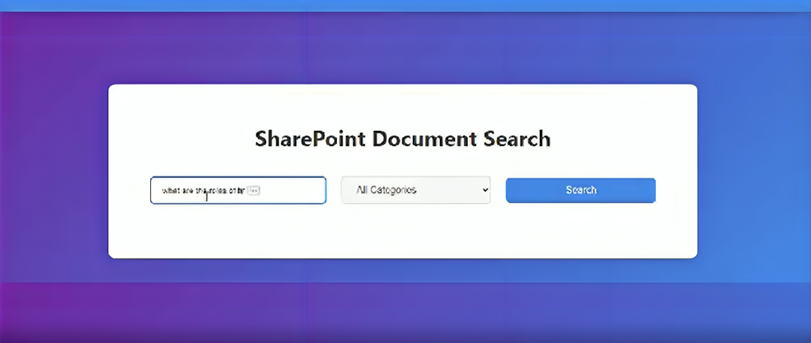
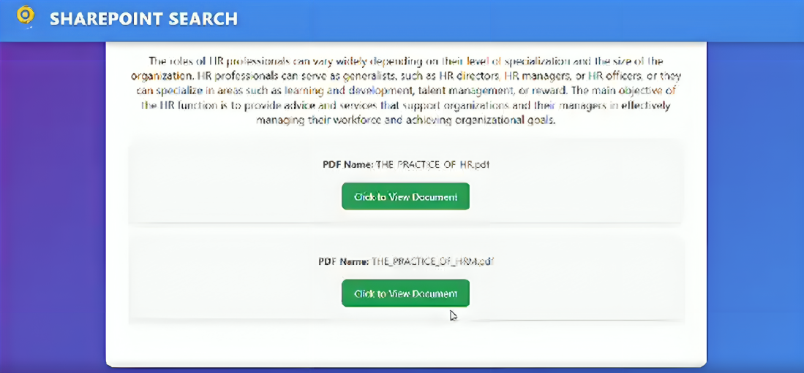

# SharePoint Document Search

This project implements a search interface for SharePoint documents, integrated with Azure Cognitive Search and Azure OpenAI for enhanced AI-powered search results. Users can input a query, select a category, and view relevant documents.

## Project Structure

```plaintext
SharePoint-Document-Search/
│
├── backend/
│   ├── function_app.py
│   ├── __init__.py
│   └── requirements.txt
├── frontend/
│   ├── index.html
│   ├── script.js
│   └── styles.css
└── README.md
```

## Backend Setup

### Prerequisites:
- **Azure OpenAI**: Set up an Azure OpenAI resource for GPT-3 interaction.
- **Azure Cognitive Search**: Create and configure an Azure Cognitive Search service and index.
- **Azure Functions**: Set up Azure Functions to deploy the backend logic.

### Environment Variables:
Make sure to configure the following environment variables for your Azure Functions to work properly:

- `AZURE_OPENAI_ENDPOINT`: Your Azure OpenAI endpoint URL.
- `AZURE_OPENAI_API_KEY`: Your Azure OpenAI API key.
- `AZURE_OPENAI_API_VERSION`: API version for Azure OpenAI.
- `AZURE_SEARCH_ENDPOINT`: Your Azure Cognitive Search endpoint URL.
- `AZURE_SEARCH_KEY`: Your Azure Cognitive Search API key.
- `AZURE_SEARCH_INDEX_NAME`: The index name for searching documents in Azure Cognitive Search.

### Backend Logic
The backend logic involves:

- **Query Embedding**: Generates an embedding for the search query using Azure OpenAI.
- **Vector Search**: Executes a vector search using the query embedding on Azure Cognitive Search.
- **Response Generation**: Uses GPT-3 to generate a response based on the search results.

Refer to the backend Python code in `function_app.py` for detailed implementation.

## Frontend Setup

The frontend provides a simple user interface allowing users to search documents. The interface includes input fields for queries and category selection.

### Frontend Components:
- `index.html`: Contains the structure of the search interface.
- `styles.css`: Handles the styling of the page and UI components.
- `script.js`: Handles the interaction with the backend API and displays search results.

### Dependencies
- **Axios**: Used for making HTTP requests from the frontend to the backend.
  Include Axios via CDN:

```html
<script src="https://cdn.jsdelivr.net/npm/axios/dist/axios.min.js"></script>
```


## Installation & Running Locally

1. Clone the repository.
2. Set up the backend by deploying Azure Functions with the correct environment variables.
3. Ensure Azure Cognitive Search and Azure OpenAI are properly configured.
4. Run the frontend by opening `index.html` in a browser.

## Example Request Flow

1. The user inputs a query, selects a category, and clicks the "Search" button.
2. The frontend sends a request to the backend, which processes the query using Azure Cognitive Search and OpenAI.
3. The results are displayed dynamically on the page.

## Output 

### Output Image of the Home Page:



### Output Image of the Result:



